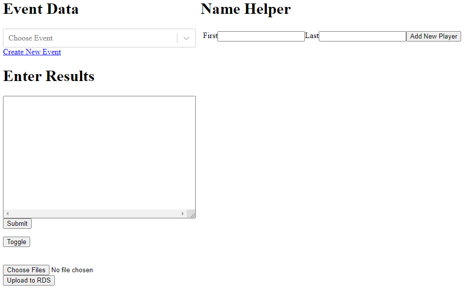

# Event Results Service

Microservice to store results from events.

## Frontend
Self help interface to enter tournament results

  

## Backend
Uses a dynamo table and s3 bucket to store and cache results

## Schema
Syntax for entering results. A entire division must be entered at once

```
start pools "<Event Name>" "<Division Name>
round <Number>
pool <Letter>
<Place> <Player Name 1> <Player Name 2> <Player Name 3> <Score>
...
```

**Event Name** must match exactly with the created event  
**Division Name** Options: Women Pairs, Open Pairs, Mixed Pairs, Open Co-op  
**Round** Number 1 - Finals, 2 - Semifinals, 3 - Quaterfinals, ...  
**Pool** Letter: A, B, C, D, ...  
**Place** Where this team placed in this pool. Teams do not need to be ordered  
**Player Name** All lowercase with _ for spaces. Ex. ryan_young  
**Score** Is a floating point number representing the points the team got in that round


Example
```
start pools "RyanTest" "Open Pairs"
round 1
pool A
1 ryan_young 123.45
2 james_wiseman 80.34
round 2
pool A
1 ryan_young 123.45
pool B
1 james_wiseman 80.34
end
```